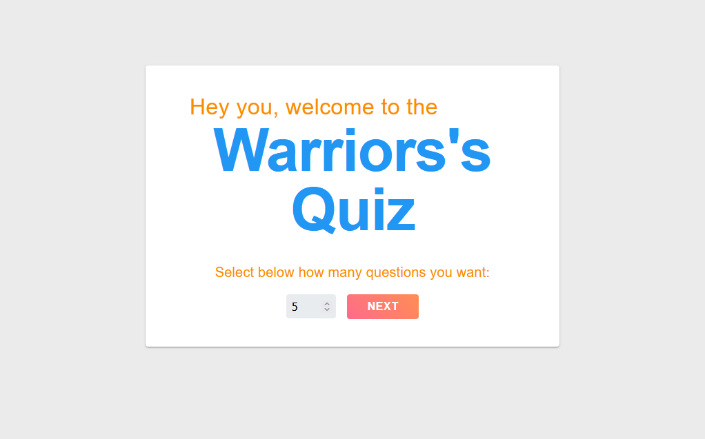

<h1 align="center">
  Warriors Quiz
</h1>
<h1 align="center">
    
</h1>

<br>

## 💻 Project

[Warriors Quiz](https://warriorsquiz.netlify.app/) is game that tests your knowledge about everything, and an excelent project to enjoy React Hooks

## 🧪 Technologies

This project was made using the followings Technologies:

- [React](https://pt-br.reactjs.org/)
- [Material UI](https://mui.com/)
- [Formik](https://formik.org/)
- [Framer-Motion](https://www.framer.com/motion/)
- [Yup](https://github.com/jquense/yupp)
- [React Icons](https://react-icons.github.io/react-icons/)

## 🪐 Running

To run the application...

```bash
# Clone the repository
$ git clone https://github.com/seufernandez/WarriorsQuiz.git


# Install all dependencies
$ yarn


# Starting App
$ yarn start
```

App will be available on port: http://localhost:3000.

## 📻 Made while listenning to

This project was made in the company of these great Artists

<details>
  <summary>Check Artists</summary>

- The Beatles

- George Harrison

- Paul McCartney

- Raul Seixas

- David Bowie

</details>

---

Made with 🧡 by Gabriel Fernandes 👋 [Join our community!](https://ahub.tech/discord)
